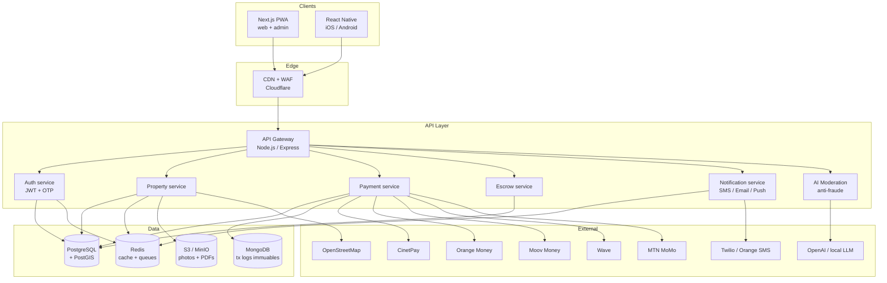
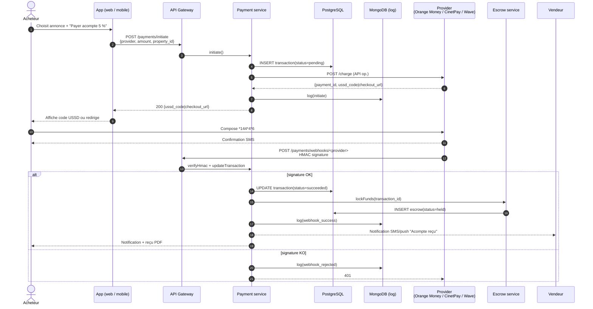
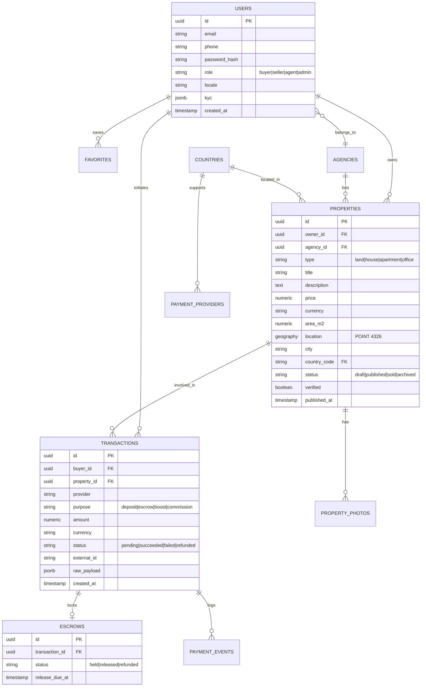

# Architecture — ImmoBF Africa

## 1. Vue d'ensemble

ImmoBF Africa est une application **cloud-native** à coût maîtrisé, conçue pour le marché ouest-africain : connectivité 4G variable, pénétration mobile élevée (70 % d'utilisateurs *mobile-only* au Burkina), et paiement dominé par le mobile money.

Principes directeurs :

- **Mobile-first** : React Native pour le natif, Next.js PWA installable pour le web.
- **Offline-first** : cache local des annonces, file de requêtes en attente synchronisée au retour du réseau.
- **API modulaire** : chaque opérateur de paiement est un plugin (`PaymentProvider`), ce qui rend l'extension à de nouveaux pays triviale.
- **Coût maîtrisé** : PostgreSQL managé + Redis + stockage objet S3-compatible suffisent jusqu'à ~10 k utilisateurs actifs / mois pour moins de 100 USD.
- **Conformité BCEAO/UEMOA** : journalisation immuable des transactions, retention 10 ans, signatures HMAC sur tous les webhooks.

## 2. Architecture globale



## 3. Flux — paiement mobile money (dépôt de garantie)



## 4. Modèle de données (simplifié)



## 5. Services et découpage

| Service        | Responsabilités                                                        | Base       |
|----------------|------------------------------------------------------------------------|------------|
| **auth**       | Signup, login, OTP SMS, JWT, refresh tokens, KYC                        | PG + Redis |
| **properties** | CRUD annonces, recherche géospatiale (PostGIS `ST_DWithin`), favoris     | PG + Redis |
| **payments**   | Orchestration mobile money, webhooks, réconciliation, reçus PDF          | PG + Mongo |
| **escrow**     | Verrouille les fonds, libère sur signature, arbitrage litiges           | PG         |
| **moderation** | Analyse IA (texte + image) pour détecter les fausses annonces           | Stateless  |
| **notif**      | SMS (Twilio / Orange SMS API), email (SMTP), push (Expo / FCM)          | Redis      |
| **analytics**  | Agrégats par ville, par agence, cohortes, export CSV/Excel              | PG         |

Le MVP les déploie comme un **monolithe modulaire** (un seul processus Node.js). Chaque module est isolé dans `backend/src/services/` pour faciliter une extraction ultérieure en microservices indépendants (K8s) quand le trafic le justifiera.

## 6. Stratégie offline-first

1. **Client web (PWA)** : Service Worker cache les pages `/properties`, `/properties/[id]` et les images via `stale-while-revalidate`. La recherche textuelle est servie depuis IndexedDB quand offline.
2. **Client mobile** : `expo-sqlite` stocke les 100 dernières annonces consultées et les favoris. Les actions (création annonce, message) sont mises en file via `@react-native-async-storage/async-storage` et rejouées au retour réseau.
3. **Uploads photos** : compression côté client à 1280 px max, JPEG qualité 70, upload en background via `expo-file-system`.

## 7. Sécurité

- **Auth** : Argon2id pour les mots de passe, JWT access (15 min) + refresh (30 j, rotation), OTP SMS pour actions sensibles (paiement > 50 000 FCFA, changement téléphone).
- **Webhooks** : HMAC-SHA256 avec secret par provider, vérification `timing-safe`, rejet des payloads > 5 min d'âge.
- **KYC** : vérification téléphone obligatoire pour publier ; pièce d'identité recto/verso + selfie pour vendre (OCR stub, intégration Onfido en V2).
- **Anti-fraude** : prix aberrant (écart > 3σ vs médiane ville/type), photos dupliquées (pHash), texte copié (Jaccard sur titres), IP/device fingerprint, taux de re-post.
- **RGPD-like** : consentement explicite, export et suppression données utilisateur, chiffrement at-rest (PG + S3), TLS partout.
- **Rate limiting** : 60 req/min/IP sur API publique, 10 req/min sur `/auth/*`.

## 8. Observabilité

- Logs structurés JSON via `pino`, collectés par Loki ou Better Stack.
- Métriques Prometheus exposées sur `/metrics`.
- Tracing OpenTelemetry optionnel (désactivé par défaut pour réduire les coûts).
- Alertes : taux d'erreur webhook > 2 %, latence p95 API > 800 ms, queue de notifications > 1 000.

## 9. Stratégie de coûts

| Composant         | Fournisseur suggéré            | Coût mensuel estimé (pilote) |
|-------------------|--------------------------------|-------------------------------|
| Frontend Next.js  | Vercel Hobby / Netlify         | 0 USD                         |
| Backend Node.js   | Railway / Fly.io / Lightsail   | 10-25 USD                     |
| PostgreSQL + PostGIS | Neon / Supabase / Aiven      | 0-25 USD                      |
| Redis             | Upstash / Railway              | 0-10 USD                      |
| MongoDB           | Atlas M0 (gratuit)             | 0 USD                         |
| Stockage photos   | Cloudflare R2 / Backblaze B2   | 2-5 USD                       |
| CDN               | Cloudflare Free                | 0 USD                         |
| SMS OTP           | Orange SMS API / Twilio        | ~0,03 USD/SMS                 |
| **Total pilote**  |                                | **~30-70 USD/mois**           |

## 10. Stratégie de scalabilité

| Palier              | Action                                                                |
|---------------------|-----------------------------------------------------------------------|
| 0-10 k MAU          | Monolithe + DB managée ; CDN Cloudflare.                              |
| 10-100 k MAU        | Extraction du service `payments` et `notif`, queue RabbitMQ / Redis Streams. |
| 100 k-1 M MAU       | Read replicas PG, sharding par pays, CDN multi-régions Afrique.       |
| > 1 M MAU           | Edge functions pour catalogue, ML valuation déployé en inference serverless. |

## 11. Interface `PaymentProvider`

```js
// backend/src/services/PaymentProvider.js
class PaymentProvider {
  get name() { throw new Error("abstract"); }          // "orange_money_bf"
  get countries() { throw new Error("abstract"); }     // ["BF", "CI", ...]
  async initiate({ amount, currency, reference, customerPhone, metadata }) {}
  verifyWebhookSignature(headers, rawBody) {}
  parseWebhook(body) {}   // => { external_id, status, amount, currency }
  async refund({ external_id, amount }) {}
}
```

Ajouter un opérateur = créer une classe concrète qui étend `PaymentProvider`, l'enregistrer dans `PaymentProviderRegistry`, configurer les secrets via variables d'environnement. Aucun autre code métier ne change.
