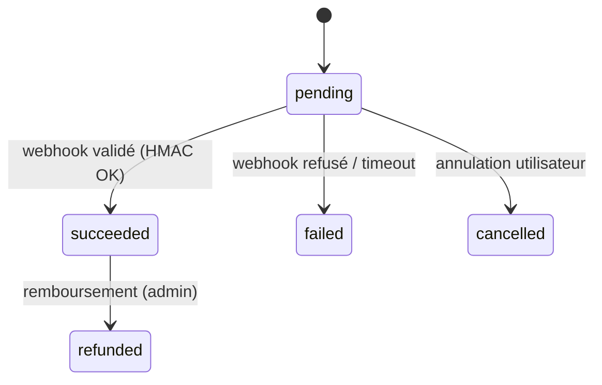

# Paiements mobile money

## Opérateurs intégrés au MVP

| Opérateur         | Pays                                  | Code USSD         | API / SDK                                                     |
|-------------------|---------------------------------------|-------------------|---------------------------------------------------------------|
| **FedaPay** ⭐     | BF, BJ, CI, SN, TG, NE, ML, GN        | via agrégateur    | `api.fedapay.com/v1` (REST + webhooks HMAC)                   |
| **CinetPay**      | BF, CI, SN, ML, TG, BJ, CM            | via agrégateur    | `api-checkout.cinetpay.com/v2` (REST)                         |
| **Orange Money**  | BF                                    | `*144*4*6#`       | `api.orange.com/orange-money-webpay/bf/v1/webpayment`         |
| **Moov Money**    | BF, TG, BJ, NE                        | `*555*6#`         | API marchand (accord Moov Africa) ou via CinetPay             |
| **Wave**          | SN, CI, BF, ML                        | —                 | `api.wave.com/v1/checkout/sessions`                           |

> ⭐ **FedaPay est le provider principal** par défaut (un seul contrat marchand pour Orange/Moov/MTN/Wave + cartes Visa/MC, activation 3-7 jours). Voir [FEDAPAY_ACTIVATION.md](./FEDAPAY_ACTIVATION.md). Les contrats directs (Orange, Moov, Wave) restent activables en parallèle pour de meilleures conditions commerciales quand le volume mensuel dépasse ~50 M FCFA.

## Extension à d'autres opérateurs (V2)

Implémenter `PaymentProvider` :

```js
const PaymentProvider = require("./PaymentProvider");

class MtnMomoProvider extends PaymentProvider {
  get name() { return "mtn_momo"; }
  get countries() { return ["CI", "GH", "UG", "CM", "RW"]; }
  async initiate(input) { /* ... */ }
  verifyWebhookSignature(headers, rawBody) { /* ... */ }
  parseWebhook(body) { /* ... */ }
}
```

L'enregistrer dans `PaymentProviderRegistry` et ajouter les variables d'environnement.

## Flux (séquence canonique)

1. **Initiate** : le client appelle `POST /payments/initiate` avec `provider`, `amount`, `property_id`, `purpose`.
2. **Création transaction** : le backend crée une ligne `transactions (status=pending)` et appelle le provider.
3. **Réponse** : le provider renvoie un `external_id` + soit un `payment_url` (Wave, CinetPay), soit un `ussd_code` (Orange, Moov). Le backend enregistre et renvoie ces infos.
4. **Validation client** : l'utilisateur compose le USSD (ou suit le lien).
5. **Webhook** : l'opérateur appelle `POST /payments/webhooks/<provider>` avec signature HMAC. Le backend :
   - vérifie la signature (timing-safe) ;
   - rejette si le payload est plus vieux que 5 minutes ;
   - idempotent si la transaction est déjà `succeeded` ;
   - met à jour la transaction et enregistre `payment_events(kind=webhook)` ;
   - si `purpose = deposit` ou `escrow` → crée une entrée `escrows (status=held, release_due_at=+30j)` ;
   - si `purpose = boost` → positionne `properties.boosted_until` ;
   - génère un reçu PDF (`backend/src/services/receipt.js`) ;
   - envoie notifications (SMS + email + push).
6. **Release escrow** : après signature chez le notaire, `POST /payments/:id/escrow/release` libère les fonds (admin/agent).



## Sécurité webhook

| Provider       | Header signature           | Algo       |
|----------------|----------------------------|------------|
| FedaPay        | `X-Fedapay-Signature`      | HMAC-SHA256 du raw body |
| CinetPay       | `X-Token` (HMAC du body)   | HMAC-SHA256 |
| Orange Money   | `X-Orange-Signature`       | HMAC-SHA256 |
| Moov Money     | `X-Moov-Signature`         | HMAC-SHA256 |
| Wave           | `Wave-Signature` (t=…,v1=…)| HMAC-SHA256 sur `t.rawBody` |

Comparaison en **temps constant** (`crypto.timingSafeEqual`). Aucun webhook ne modifie l'état sans signature valide.

## Frais & commissions

- Commission plateforme : **2 %** configurable (`APP_COMMISSION_PCT`) prélevée à la libération de l'escrow.
- Frais opérateur : supportés par l'acheteur pour les dépôts, répercutés automatiquement.
- Boost annonce : **5 000 FCFA / 7 jours** (`BOOST_PRICE_XOF`).
- Abonnement agence : **20 000 FCFA / mois** (`AGENCY_SUBSCRIPTION_XOF`).
- Conformité BCEAO/UEMOA : la TVA locale peut être activée via un paramètre `taxes` par pays (V2).

## Tester en local sans secrets

Les providers détectent l'absence de secret et passent en **mode stub** : ils retournent un `payment_url` vers `/mock-checkout?ref=…` et un `ussd_code`. Puis :

```bash
curl -X POST http://localhost:4000/api/v1/payments/mock/IMO-123.../succeed
```

…force la transaction à `succeeded`, déclenche la génération du reçu et la création d'escrow.

## Réconciliation

Tâche cron quotidienne `scripts/reconcile.js` (à implémenter en V2) : pour chaque transaction `pending > 24h`, interroger l'API de l'opérateur pour récupérer le statut réel (robustesse en cas de webhook perdu).

## Conformité

- **BCEAO / UEMOA** : journalisation immuable (MongoDB `payment_logs`, `createIndex({ transaction_id: 1, ts: 1 })`, retention 10 ans), export audit à la demande.
- **GDPR-like** : l'utilisateur peut exporter ses transactions (`GET /me/export`) et demander l'anonymisation (`POST /me/forget`).
- **Lutte contre le blanchiment** : seuils KYC (>50 000 FCFA/mois = pièce d'identité requise), détection de patterns (transactions en rafale, destinataires multiples).
